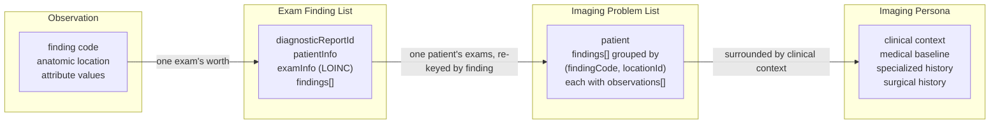

# The ladder

The second of OIDM's three strategic pillars is a hierarchy of data structures, described in the January 2026 status deck as "the atomic Observation, then the Exam Finding List, then the Imaging Problem List, then the 'Imaging Persona'."[^deck] Each level is the one below it, collected and re-keyed.

| Level | Scope | What it adds | Key it is organized by |
|---|---|---|---|
| [Observation](/data-structures/observation.md) | one finding on one exam | what was seen, where, and how it was characterized | none; it is the atom |
| [Exam Finding List](/data-structures/exam-finding-list.md) | one exam | the exam envelope: report identity, patient, and a LOINC-coded exam type | the exam |
| [Imaging Problem List](/data-structures/imaging-problem-list.md) | one patient | time: every observation of a finding across every exam | the finding |
| [Imaging Persona](/data-structures/imaging-persona.md) | one patient | clinical context around the imaging: orders, baseline, specialized and surgical history | the patient |

The turn happens at level three. An [Exam Finding List](/glossary/exam-finding-list.md) is organized by exam, the way radiology reports have always been organized. An [Imaging Problem List](/glossary/imaging-problem-list.md) is "organized by finding, meaning pathology, rather than by chronology,"[^deck] which is what makes the deck's core query, "was finding X present on the most recent study?", a lookup rather than a search through a stack of reports.

# What each level adds

**Observation.** The deck states it as "what + where + attributes": a finding tag, an [anatomic location](/glossary/anatomic-location.md), and lesion characteristics, carrying presence indicators, change from prior, and measurements, in "a universal structure across systems."[^deck] It has no identity outside the list that contains it.

**Exam Finding List.** "In the context of an imaging exam, a list of the findings declared as present/absent on that exam."[^ipl-main] Two of its properties are stated as requirements rather than conveniences. It "must also have basic information (keyed by a curated list of LOINC codes) about what exam this is," and "the same finding type may be declared as present multiple times; each time is a separate entry."[^ipl-main] The second rule is why three kidney stones are three observations rather than one observation with a count of three.

**Imaging Problem List.** "In the context of a patient, the list of findings that have been described as present/absent in exams of the patient."[^ipl-main] Each entry holds every observation of that finding, each carrying its source report, exam date, exam type, and presence. On the development branch the grouping key is finding code **and** anatomic location, so "one finding code at distinct sites (e.g. ascending vs. abdominal aortic aneurysm) yields separate entries."[^ipl-claude-dev]

**Imaging Persona.** Named in the deck and nowhere else. It is the goal of surrounding the problem list with clinical context, medical baseline, specialized history, and surgical history.[^deck] No specification or sample exists.

# How identifiers thread through

Nothing in the hierarchy embeds a definition. Every level refers to the [semantic foundation](/semantic-foundation/) by code, which is what lets two systems agree on a finding without sharing a database.

| Identifier | Form | Where it enters | Example |
|---|---|---|---|
| [OIFM](/glossary/oifm.md) finding identifier | `OIFM_[A-Z]{3,4}_[0-9]{6}` | `findingCode` on an observation; `finding_type_code` on a problem list entry | `OIFM_GMTS_016552` |
| OIFMA [attribute](/glossary/attribute.md) identifier | `OIFMA_[A-Z]{3,4}_[0-9]{6}` | `attributeCode` inside an observation's `attributes` array | `OIFMA_GMTS_707209` |
| Attribute [value](/glossary/attribute-value.md) code | the attribute identifier plus a dot and the value's position | `attributeValueCode` | `OIFMA_GMTS_707209.1` for present |
| [RadLex identifier](/glossary/radlex-id.md) | `RID####`, with sided structures composite | `anatomicLocation.locationId` | `RID42239`, and `RID39518_RID5824` for a left shoulder |
| [LOINC](/glossary/loinc.md) code | LOINC part number | `examInfo.studyLoincCode`, and `exam_type_code` on a problem list observation | `26158-6` |

The letter block inside an OIFM identifier is the [organization code](/glossary/oidm-organization-code.md) of the contributing organization, so a single exam's findings routinely mix codes from several contributors. The five-finding worked example does exactly that, drawing on `GMTS`, `OIDM`, and `CDE` identifiers in one list.[^efl-sample]

# Implementation status

| Level | Status | What exists |
|---|---|---|
| Observation | Specified as part of the Exam Finding List; no standalone model | The `findings[]` entry shape, real sample data, and a separate extraction-time Pydantic model on the development branch. A formal Observation model is [issue 1](https://github.com/openimagingdata/imaging-problem-list/issues/1), unclaimed.[^issue1] |
| Exam Finding List | Specified in prose, with real sample data and generator scripts | Field-level specification on `main`, ten sample lists for one synthetic patient, and a generator from a working spreadsheet. No published JSON Schema. |
| Imaging Problem List | Specified, generated, and rendered | A generator that aggregates Exam Finding Lists, sample output for two synthetic patients, and a deployed viewer. |
| Imaging Persona | Concept only | Four named context categories in the deck. No artifact. |
| FHIR encoding of any level | Documented only | The mappings are written down and implemented nowhere. See [FHIR mapping](/data-structures/fhir-mapping.md). |

The absence at the bottom of the ladder is the one the project has flagged itself. Issue 1 asks for Pydantic models for Observation, Exam Finding List, and Imaging Problem List, with "extensive annotation to generate JSON schemas" and camelCase aliases on export against snake_case attributes internally.[^issue1] Until that lands, the structures are defined by prose, by sample data, and by the scripts that read and write them. The stated direction is collected in [the IPL data model system roadmap](/roadmap/ipl-data-model-system.md).

[^deck]: "Open Imaging Data Model 2026 Status Update: Realizing Object-Oriented Imaging Results", January 2026
[^ipl-main]: imaging-problem-list README, main branch
[^ipl-claude-dev]: imaging-problem-list domain model notes, dev branch
[^efl-sample]: An Exam Finding List with anatomic locations, dev branch
[^issue1]: imaging-problem-list issue 1, "Create System of Data Models"
