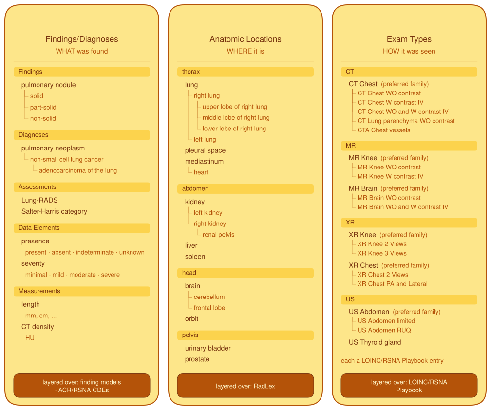
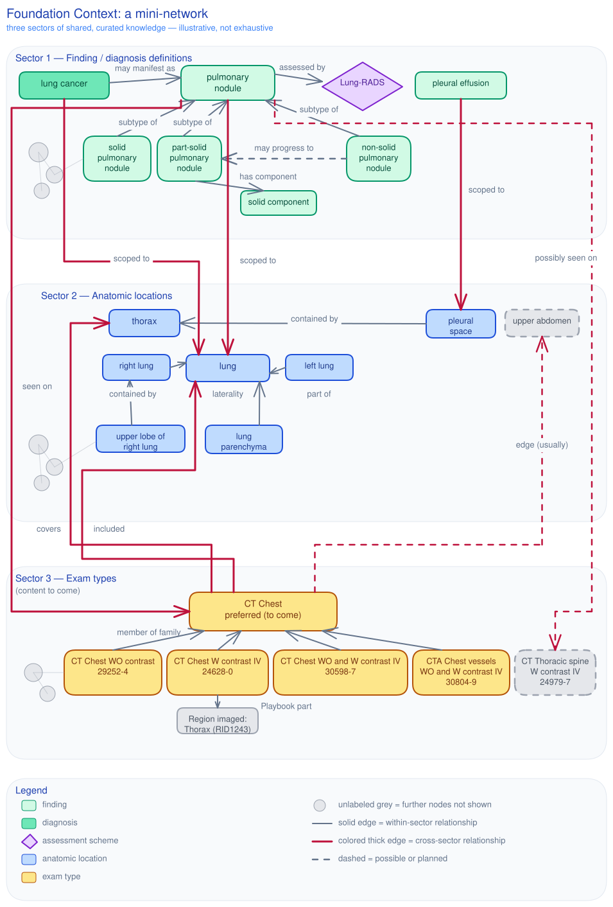

# Foundation Context

Foundation Context is the shared, curated knowledge that every patient's imaging data is woven into. It is one layer for everyone: definitions of what can be found, where things are in the body, how exams see them, the relationships among all of these, and citations out to the standards and references the definitions rest on. It is open-source, general clinical knowledge, authored by the imaging informatics community in the open. It covers both the schema that definitions take and the work of building the content.[^siim-2026][^lead-2026-09-24]

It has three axes. Each is a curated layer over a standard that already exists, adding imaging-specific knowledge rather than reinventing it.[^siim-2026]

**Finding/diagnosis definitions: what was found.** One kind of content, held today in two collections: the Open Imaging Finding Models, inclusive and fast-moving, and the ACR/RSNA Common Data Elements, well-reviewed and closer to published. Both are moving onto a single graph-based schema being developed in the CDE project, which applications will use across both collections at once.[^lead-2026-09-24]

**Anatomic locations: where it is.** A curated index of anatomic entities anchored in RadLex, with containment, part-of, and laterality made explicit, now being incorporated into RadLex itself.[^build-plan][^siim-2026]

**Exam types: how it was seen.** Content to come: preferred exam families over the LOINC/RSNA Radiology Playbook, each connected to the anatomy it covers.[^build-plan][^siim-2026]

The axes are not independent. A definition says which anatomy it applies to and which modalities can show it. An exam type says which anatomy it covers. Definitions relate to one another as subtype and supertype, cause and effect, diagnosis and the findings it manifests as, things confused with each other, things that occur together. These relationships, with the citations out to Radiopaedia, Wikipedia, SNOMED CT, RadLex, LOINC, FMA, ICD, and CPT, are what turn a flat dictionary into something an application can reason over.[^siim-2026]

(click the image for full size)

# In this section

- Finding/diagnosis definitions: finding models and CDEs, with the OIFM content, the definition formats, and the identifiers
- The next-generation schema, with the relationship family and standard clinical metadata
- Authoring and review
- [Anatomic locations](./anatomic-locations.md)
- [Exam types](./exam-types.md)
- [Standards the foundation layers over and cites](./standards.md)

[^lead-2026-09-24]: The project lead, 2026-09-22 to 2026-09-24: the two collections ruling, the shared next-generation schema for both, the RadLex migration, and the wording of the opening paragraph; recorded verbatim in the layout plan.
[^siim-2026]: SIIM 2026 annual meeting talk, June 2026, Mass General Brigham; slides 6, 7, 8, 10, 11, and 12.
[^build-plan]: Knowledgebase build plan: the project lead's stated goals on anatomic locations and exam types (2026-09-20).
