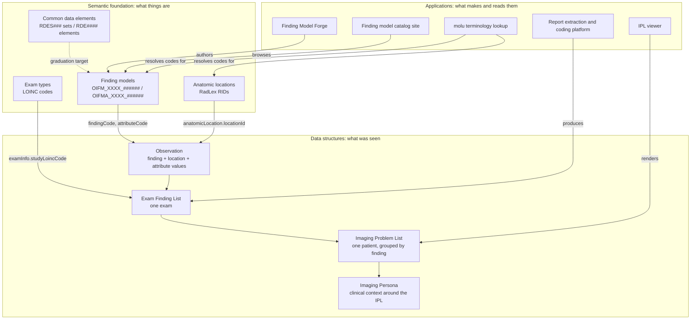

# The shape of the system

OIDM is three layers stacked on each other, and the joints between them are identifiers. The semantic foundation defines what things are and gives each one a code. The data structures carry instances of those things, referring to them only by code. The applications create and read those structures. Nothing in the upper layers embeds a definition; everything points.

This is what makes the system work across organizations. Two systems can agree that a finding is `OIFM_GMTS_016552` located at `RID42239` without sharing any code, any database, or any vendor.



# The semantic foundation

A [finding model](/glossary/finding-model.md) is the definition of one radiology finding: a name, a description, synonyms, tags, optional anatomic locations, optional [index codes](/glossary/index-code.md) into external ontologies, and a list of [attributes](/glossary/attribute.md) that a radiologist would use to characterize it. Each carries an [OIFM identifier](/glossary/oifm.md) matching `OIFM_[A-Z]{3,4}_[0-9]{6}`, where the letter block identifies the contributing organization. Each attribute carries an `OIFMA_[A-Z]{3,4}_[0-9]{6}` identifier, and each choice value extends its attribute identifier with a dot suffix, so `OIFMA_GMTS_707209.1` is a specific value of a specific attribute of a specific finding.[^fm-model] A flat registry file maps every issued identifier to its definition file, which is how duplicates are caught.[^fm-ids]

[Anatomic locations](/glossary/anatomic-location.md) are keyed by RadLex identifiers of the form `RID####`. Sided structures are composite, as in `RID294_RID5824` for the left variant of the uterine adnexa. Two hierarchies are carried, ["contained by" and "part of"](/glossary/contained-by-and-part-of.md), together with a [laterality](/glossary/laterality.md) triad linking unsided, left, and right variants, and cross-references to SNOMED CT, FMA, UMLS, and MESH.[^anat-docs]

[Common data elements](/glossary/cde.md) are the formally governed counterpart, published by the ACR and RSNA through RadElement with `RDES###` set identifiers and `RDE####` element identifiers. They are external to OIDM. The relationship runs the other way from the one people expect: finding models are the fast-moving workbench, and proven definitions are candidates to graduate into common data elements.[^deck]

[Exam types](/glossary/exam-type.md) are coded with LOINC. The Exam Finding List requires a LOINC code on its exam header, and the only written design for a richer exam-type capability, one that would weight the LOINC and RSNA Radiology Playbook vocabulary for orderables and carry Playbook correspondences in crosswalk provenance, lives in the terminology lookup roadmap.[^molu-roadmap]

# The data structures

An [Observation](/glossary/observation.md) is the atomic unit: what, where, and how. The deck states it as a finding tag plus an anatomic location plus lesion characteristics, carrying presence indicators, change from prior, and measurements.[^deck] In the Exam Finding List JSON this appears as a `findingCode` with its `findingDescription`, an optional `anatomicLocation` object holding a RadLex identifier and display text, and an `attributes` array of attribute code, value code, and descriptions.

```json
{
  "observationId": "finding1",
  "findingCode": "OIFM_GMTS_016552",
  "findingDescription": "urinary tract calculus",
  "anatomicLocation": { "locationId": "RID42239", "locationDisplay": "left acromioclavicular joint" },
  "attributes": [
    {
      "attributeCode": "OIFMA_GMTS_707209",
      "attributeDescription": "presence",
      "attributeValueCode": "OIFMA_GMTS_707209.1",
      "attributeValueDescription": "present"
    }
  ]
}
```

An [Exam Finding List](/glossary/exam-finding-list.md) wraps all observations from one exam with a report identifier, patient information, and exam information including the LOINC-coded exam type. Repeated instances of the same finding get separate entries, each with its own observation identifier, so three kidney stones are three observations rather than one with a count.[^ipl-main]

An [Imaging Problem List](/glossary/imaging-problem-list.md) reorganizes observations across a patient's exams by finding rather than by date, which is what makes the question "was finding X present on the most recent study" a lookup instead of a search.[^deck] An [Imaging Persona](/glossary/imaging-persona.md) is the stated goal of surrounding that with clinical context, medical baseline, specialized history, and surgical history. It exists in the deck and nowhere else.

The 2024 site post describes the surrounding model in wider terms, listing observations, current report text, imaging studies, patient, order, prior studies, tracked observations, and electronic health record data as the elements OIDM organizes over FHIR.[^site-structure]

# The applications

Finding Model Forge is the authoring front end: sign in, name a finding, generate a description, review it, generate attributes, and save a draft that moves through a submission and review lifecycle.[^forge] The catalog site reads finding model definitions directly out of the content repository at build time and renders browsable pages. The report extraction and coding platform takes narrative report text, extracts findings in chunks, validates against verbatim quotes, and assigns finding and location codes in a separate post-extraction coding pass.[^ipl-dev] The viewer renders Imaging Problem Lists, with a second-generation anatomy-aware dashboard. The `molu` terminology lookup library resolves terms and codes across RadLex, SNOMED CT, FMA, LOINC, and UMLS, which is the infrastructure the enrichment and coding work depends on.

The rule that keeps the coding honest is stated in the assignment rules document on the extraction platform's development branch: an anatomic location is attached only when the report localizes the finding, and is omitted rather than guessed when it does not.[^ipl-anat-rules]

# Implementation status

The layers are at very different stages. This table states where each piece actually stands.

| Piece | Status | Evidence |
|---|---|---|
| Finding model format and identifiers | Shipped | `FindingModelFull` in `findingmodel` at `main`, published as a PyPI package[^fm-model] |
| Finding model content corpus | Shipped, growing | 2,382 definitions and a matching identifier registry in `findingmodels` at `main`[^fm-ids] |
| MGB exam-oriented sub-taxonomies | In progress on `taxonomy-export-2026-08-15` | 3,789 rows across six modality CSVs, 1,028 matched to existing OIFM identifiers by exact name[^fm-taxonomies] |
| Canonical structured metadata rewrite | In progress on `feature/metadata-cleanup` | Eight new optional metadata fields and a multi-agent enrichment architecture; the branch's own readiness assessment is not yet passing[^metadata-rewrite] |
| Anatomic locations, current implementation | Shipped | `anatomic-locations` package inside `findingmodel`, 2,926 source records, DuckDB-backed search and hierarchy CLI[^anat-docs] |
| Anatomic locations, original lineage | Shipped, superseded as the working set | 2,890-node dataset and wrapper libraries from `anatomiclocations.org`, last data release 2022[^anat-site] |
| RadLex incorporation of anatomic locations | Documented only | RSNA `RadLex` issue #3 tracks it with an exit criterion of full coverage; no code or ontology content in the RadLex repository yet refers to it |
| Common data elements at RadElement | Shipped, external | Governed by the ACR and RSNA; OIDM consumes it and stages candidates toward it |
| Exam types | Concept only | No artifact exists; the only written design is the terminology lookup roadmap's proposed radiology profile[^molu-roadmap] |
| Observation and Exam Finding List format | Shipped as spec and sample data | Field-level specification and real sample JSON in `imaging-problem-list` at `main`[^ipl-main] |
| Formal model layer for the data structures | Documented only | `imaging-problem-list` issue #1 asks for Pydantic models with JSON Schema export for Observation, Exam Finding List, and Imaging Problem List; unclaimed |
| Imaging Problem List format and viewer | Shipped | Specification, sample data, and a deployed viewer at `imaging-problem-list.pages.dev`[^ipl-main] |
| Imaging Persona | Concept only | Named in the deck with four context categories; no specification or code[^deck] |
| FHIR mapping of the data structures | Documented only | The mapping is described in the repository documentation and demonstrated by lineage samples; it is implemented nowhere |
| Finding Model Forge | Shipped | Deployed at `fmf.oidm.org`; post-creation model editing is open issue #13[^forge] |
| Finding model catalog site | Shipped | Static Astro site reading definitions from the content repository through a git submodule |
| Report extraction and coding platform | In progress on `dev` | Extraction, coding, persistence, evaluation, API, and review tooling, 258 commits ahead of `main`[^ipl-dev] |
| Early extraction pipeline prototype | Superseded | Four-stage prototype producing presence and mapping records only, not Exam Finding Lists |
| Terminology lookup | Shipped | `molu` library and CLI over RadLex, SNOMED CT, FMA, LOINC, and UMLS[^molu-roadmap] |
| Open Imaging Reporting SDK | Concept only | Named as a strategic pillar in the deck; no repository or artifact exists[^deck] |
| ACR-OIDM working group | Proposed | Stated as a call to action in the deck; not recorded as convened[^deck] |

Per-area goals and the sources that state them are collected under [roadmap](/roadmap/). Every repository, its role, and its branch of record are listed in [the repository map](/repositories/repository-map.md).

[^deck]: Open Imaging Data Model 2026 Status Update, January 2026
[^fm-model]: FindingModelFull definition, findingmodel repository, main
[^fm-ids]: OIFM identifier registry, findingmodels repository, main
[^fm-taxonomies]: MGB exam-oriented sub-taxonomies, findingmodels taxonomy-export-2026-08-15 branch
[^anat-docs]: Anatomic locations package documentation, findingmodel main
[^anat-site]: anatomiclocations.org site homepage and roadmap
[^metadata-rewrite]: Canonical structured metadata and enrichment rewrite, findingmodel feature/metadata-cleanup branch
[^ipl-main]: imaging-problem-list README, main branch
[^ipl-dev]: imaging-problem-list README, dev branch
[^ipl-anat-rules]: Anatomic location assignment rules, imaging-problem-list dev
[^molu-roadmap]: med-ontology-lookup product roadmap
[^forge]: Finding model creation workflow, FindingModelForge dev branch
[^site-structure]: "Data Model: Structure and Function", 2024-01-25
