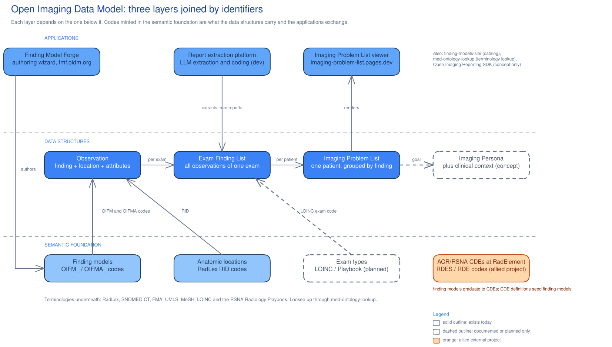

# The shape of the system

OIDM has three layers joined by identifiers. The semantic foundation defines concepts and assigns codes. Data structures hold instances that reference those definitions by code. Applications create and read the structures without embedding definitions.

Shared identifiers let systems agree that a finding is `OIFM_GMTS_016552` at `RID42239` without sharing code, databases, or vendors.

[](./architecture.svg)

*Diagram source: `architecture.excalidraw` beside this document (click the image for full size), generated by `tools/diagrams/build_architecture.py`.*

# The semantic foundation

A [finding model](/glossary/finding-model.md) defines one radiology finding with a name, description, synonyms, tags, and [attributes](/glossary/attribute.md) that characterize it. It can include anatomic locations and [index codes](/glossary/index-code.md) into external ontologies. Its [OIFM identifier](/glossary/oifm.md) matches `OIFM_[A-Z]{3,4}_[0-9]{6}`, with the letter block identifying the contributing organization. Attribute identifiers match `OIFMA_[A-Z]{3,4}_[0-9]{6}`. Choice values add a dot suffix to the attribute identifier, as in `OIFMA_GMTS_707209.1`.[^fm-model] A flat registry maps issued identifiers to definition files to detect duplicates.[^fm-ids]

[Anatomic locations](/glossary/anatomic-location.md) use RadLex identifiers of the form `RID####`. Sided structures use composite identifiers, such as `RID294_RID5824` for the left uterine adnexa. Locations have ["contained by" and "part of"](/glossary/contained-by-and-part-of.md) hierarchies, [laterality](/glossary/laterality.md) links between unsided, left, and right variants, and cross-references to SNOMED CT, FMA, UMLS, and MESH.[^anat-docs]

[Common data elements](/glossary/cde.md) are external to OIDM, governed by the ACR and RSNA, and published through RadElement. Sets use `RDES###` identifiers, and elements use `RDE####`. Finding models support experimentation, with proven definitions becoming candidates for common data elements.[^deck]

[Exam types](/glossary/exam-type.md) use LOINC codes, which the Exam Finding List requires in its exam header. The terminology lookup roadmap contains the only written design for richer exam-type support. It proposes weighting LOINC and RSNA Radiology Playbook vocabulary for orderables and recording Playbook correspondences in crosswalk provenance.[^molu-roadmap]

# The data structures

An [Observation](/glossary/observation.md) records a finding tag, anatomic location, and lesion characteristics, including presence, change from prior, and measurements.[^deck] The Exam Finding List JSON represents these as `findingCode` and `findingDescription`, an optional `anatomicLocation` with a RadLex identifier and display text, and an `attributes` array with attribute codes, value codes, and descriptions.

```json
{
  "observationId": "finding1",
  "findingCode": "OIFM_GMTS_016552",
  "findingDescription": "urinary tract calculus",
  "anatomicLocation": { "locationId": "RID42239", "locationDisplay": "left acromioclavicular joint" },
  "attributes": [
    {
      "attributeCode": "OIFMA_GMTS_707209",
      "attributeDescription": "presence",
      "attributeValueCode": "OIFMA_GMTS_707209.1",
      "attributeValueDescription": "present"
    }
  ]
}
```

An [Exam Finding List](/glossary/exam-finding-list.md) collects an exam's observations with a report identifier, patient information, and exam information, including the LOINC-coded exam type. Repeated instances of the same finding get separate entries, each with its own observation identifier, so three kidney stones are three observations rather than one with a count.[^ipl-main]

An [Imaging Problem List](/glossary/imaging-problem-list.md) groups observations across a patient's exams by finding to answer "was finding X present on the most recent study" with a lookup.[^deck] An [Imaging Persona](/glossary/imaging-persona.md) would add clinical context, medical baseline, specialized history, and surgical history. It is a goal recorded only in the deck.

The 2024 site post describes a broader model organized over FHIR. It includes observations, current report text, imaging studies, patient, order, prior studies, tracked observations, and electronic health record data.[^site-structure]

# The applications

Finding Model Forge supports authoring and review. Authors sign in, name a finding, generate and review a description, generate attributes, and save a draft for submission and review.[^forge] The catalog site reads definitions from the content repository at build time and creates browsable pages.

The report extraction and coding platform extracts findings from chunks of narrative report text and validates them against verbatim quotes. A separate pass assigns finding and location codes.[^ipl-dev] The rule that keeps the coding honest is stated in the assignment rules document on the extraction platform's development branch: an anatomic location is attached only when the report localizes the finding, and is omitted rather than guessed when it does not.[^ipl-anat-rules]

The viewer displays Imaging Problem Lists and has a second-generation anatomy-aware dashboard. The `molu` library supports enrichment and coding through term and code lookup across RadLex, SNOMED CT, FMA, LOINC, and UMLS.

# Implementation status

The layers are at very different stages. This table states where each piece actually stands.

| Piece | Status | Evidence |
|---|---|---|
| Finding model format and identifiers | Shipped | `FindingModelFull` in `findingmodel` at `main`, published as a PyPI package[^fm-model] |
| Finding model content corpus | Shipped, growing | 2,382 definitions and a matching identifier registry in `findingmodels` at `main`[^fm-ids] |
| MGB exam-oriented sub-taxonomies | In progress on `taxonomy-export-2026-08-15` | 3,789 rows across six modality CSVs, 1,028 matched to existing OIFM identifiers by exact name[^fm-taxonomies] |
| Canonical structured metadata rewrite | In progress on `feature/metadata-cleanup` | Eight new optional metadata fields and a multi-agent enrichment architecture; the branch's own readiness assessment is not yet passing[^metadata-rewrite] |
| Anatomic locations, current implementation | Shipped | `anatomic-locations` package inside `findingmodel`, 2,926 source records, DuckDB-backed search and hierarchy CLI[^anat-docs] |
| Anatomic locations, original lineage | Shipped, superseded as the working set | 2,890-node dataset and wrapper libraries from `anatomiclocations.org`, last data release 2022[^anat-site] |
| RadLex incorporation of anatomic locations | Documented only | RSNA `RadLex` issue #3 tracks it with an exit criterion of full coverage; no code or ontology content in the RadLex repository yet refers to it |
| Common data elements at RadElement | Shipped, external | Governed by the ACR and RSNA; OIDM consumes it and stages candidates toward it |
| Exam types | Concept only | No artifact exists; the only written design is the terminology lookup roadmap's proposed radiology profile[^molu-roadmap] |
| Observation and Exam Finding List format | Shipped as spec and sample data | Field-level specification and real sample JSON in `imaging-problem-list` at `main`[^ipl-main] |
| Formal model layer for the data structures | Documented only | `imaging-problem-list` issue #1 asks for Pydantic models with JSON Schema export for Observation, Exam Finding List, and Imaging Problem List; unclaimed |
| Imaging Problem List format and viewer | Shipped | Specification, sample data, and a deployed viewer at `imaging-problem-list.pages.dev`[^ipl-main] |
| Imaging Persona | Concept only | Named in the deck with four context categories; no specification or code[^deck] |
| FHIR mapping of the data structures | Documented only | The mapping is described in the repository documentation and demonstrated by lineage samples; it is implemented nowhere |
| Finding Model Forge | Shipped | Deployed at `fmf.oidm.org`; post-creation model editing is open issue #13[^forge] |
| Finding model catalog site | Shipped | Static Astro site reading definitions from the content repository through a git submodule |
| Report extraction and coding platform | In progress on `dev` | Extraction, coding, persistence, evaluation, API, and review tooling, 258 commits ahead of `main`[^ipl-dev] |
| Early extraction pipeline prototype | Superseded | Four-stage prototype producing presence and mapping records only, not Exam Finding Lists |
| Terminology lookup | Shipped | `molu` library and CLI over RadLex, SNOMED CT, FMA, LOINC, and UMLS[^molu-roadmap] |
| Open Imaging Reporting SDK | Concept only | Named as a strategic pillar in the deck; no repository or artifact exists[^deck] |
| ACR-OIDM working group | Proposed | Stated as a call to action in the deck; not recorded as convened[^deck] |

See [roadmap](/roadmap/) for goals and their sources, and [the repository map](/repositories/repository-map.md) for repository roles and branches of record.

[^deck]: Open Imaging Data Model 2026 Status Update, January 2026
[^fm-model]: FindingModelFull definition, findingmodel repository, main
[^fm-ids]: OIFM identifier registry, findingmodels repository, main
[^fm-taxonomies]: MGB exam-oriented sub-taxonomies, findingmodels taxonomy-export-2026-08-15 branch
[^anat-docs]: Anatomic locations package documentation, findingmodel main
[^anat-site]: anatomiclocations.org site homepage and roadmap
[^metadata-rewrite]: Canonical structured metadata and enrichment rewrite, findingmodel feature/metadata-cleanup branch
[^ipl-main]: imaging-problem-list README, main branch
[^ipl-dev]: imaging-problem-list README, dev branch
[^ipl-anat-rules]: Anatomic location assignment rules, imaging-problem-list dev
[^molu-roadmap]: med-ontology-lookup product roadmap
[^forge]: Finding model creation workflow, FindingModelForge dev branch
[^site-structure]: "Data Model: Structure and Function", 2024-01-25
